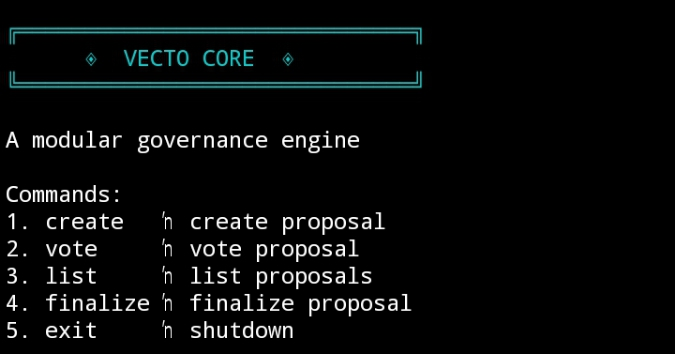

# ◈ VECTO CORE

A modular CLI governance engine built on Intercom architecture.

VECTO provides a lightweight proposal lifecycle system
with deterministic state transitions and terminal-based interaction.

---

## ✦ Features

- Proposal creation
- Voting mechanism
- Proposal finalization
- State inspection
- Clean modular CLI interface

---

## 🚀 Installation

```bash
git clone https://github.com/pujogresik/vecto.git
cd vecto
npm install
node index.js
```

---

## 🖥 Dashboard



VECTO terminal successfully initialized and ready.

---

## 📦 Execution Flow

1. Create proposal
2. Vote proposal
3. List proposals
4. Finalize proposal
5. Exit system

All state transitions are handled deterministically in memory.

---

## 🔐 Trac Address

```
trac106efxugftedd5775zlqj0xt9my5w6vxwcuuythfzy9zawdnlc7msml0jy3
```

---

Built for modular governance experimentation on Intercom stack.
